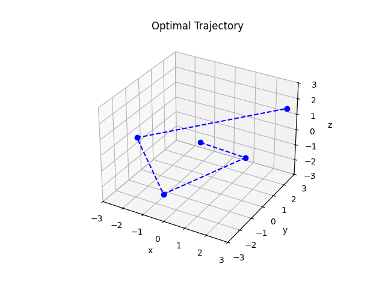
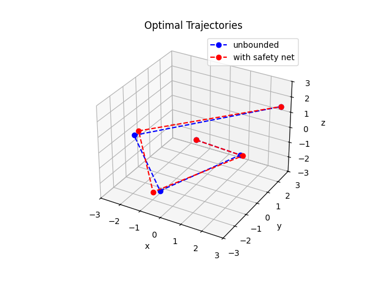
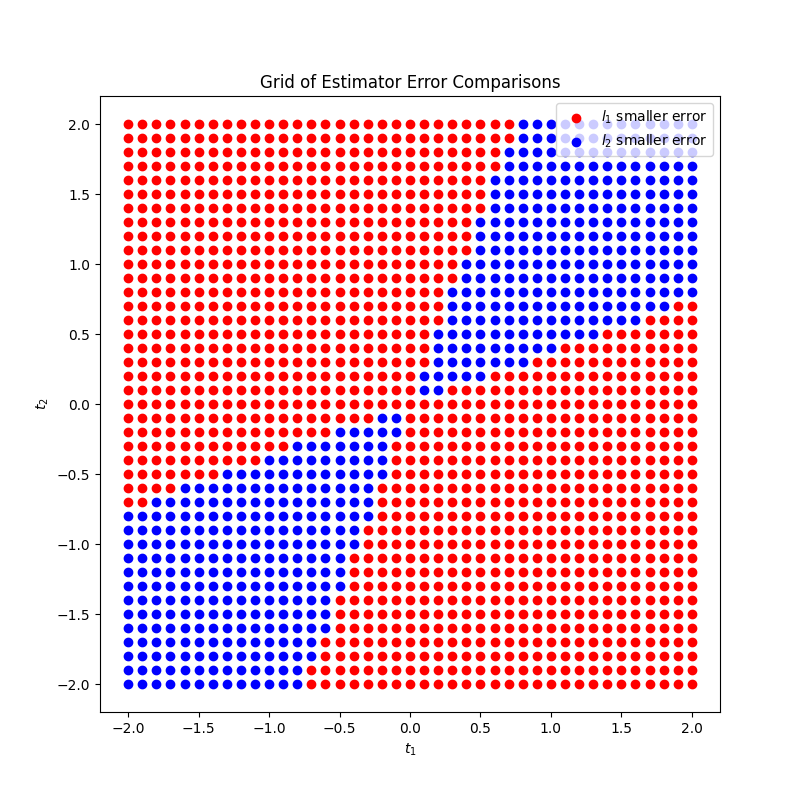

## 1.4

## 1.5

Without the safety net, we get:

- optimal energy: 32.732
- optimal input: [-1.4076087 2.88043478 0.71195652 -4.68478261]

When using the safety net, we get:

- optimal energy: 32.996
- optimal input:
  [-1.48333333 3.18333333 0.33333333 -4.53333333]

The optimal trajectories are extremely similar, it looks like the safety net just iniatiated a slight in-ward nudge to each of the waypoints to make it fit inside the bounding rectangular prism. Similarly, the optimal energy with the safety net is only trivially larger by 0.264. This matches our intuition, where the minimum should get worse (larger) when we add new constraints to the problem (safety net).

## 2

The plot shows a very clear pattern.
The blue points (t1, t2, where l2 yields a smaller error than l1) fall strictly between 2 lines that are symmetric about y=x and go through the origin.
The top line, (-2, -0.75) to (2, 0.75) is roughly t2 = 0.375t1.
The bottom line, (-0.75, -2) to (0.75, 2) is roughly t2 = 2.667t1.
Thus, we can hypothesize that for t2 in between 0.375t1 and 2.667t1, l2 outerperforms l1 in terms of x estimation.
