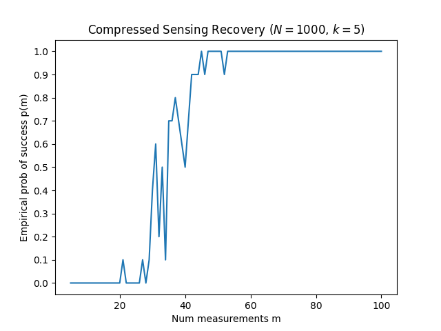

## 2

```
Experiment finished, found: 25609
Experiment finished, found: 24793
Experiment finished, found: 19045
Experiment finished, found: 12780
Experiment finished, found: 21220
Experiment finished, found: 25642
Experiment finished, found: 27078
Experiment finished, found: 21739
Experiment finished, found: 20372
Experiment finished, found: 14349

Average # of vertices over 10 runs: 21262.7
```

Our experiment fund that around 21000 vertices are expected for the feasible set of the given LP. There was n=40 elements of x and m=5 constraints. We iterated through all C(n, m) = 658008 combinations of potential vertices. Roughly 3% of the combinations were actual vertices of the feasible set.

## 3

```
LP solution: x* = ['3.00000000', '0.00000000', '3.00000000', '3.00000000', '3.00000000'] => 51.00000000
```

NOTE: we can see that $x^*$ is in $\bar{S}$. Since all the elements of vector x that optimizes the LP-relaxed problem are integer, this LP-relaxed solution is the same as the original IP solution. Thus, we used LP to solve IP! [3 0 3 3 3] is both the LP and IP solution, yielding the optimal value of 51. Thus, the difference between the optimal objective values of IP and its LP-relaxation is 0 since their the same!

## 4

```
Min Cost: 2650.000
C1 C2 C3
W1: ['0.000', '30.000', '10.000']
W2: ['30.000', '0.000', '0.000']
W3: ['0.000', '0.000', '20.000']
```

In words, the optimal configuration induces warehouse 1 to send 30 units to customer 2 and 10 units to customer 3.
Warehouse 2 should send 30 units to customer 1.
There will be 20 leftover demand from customer 3 that will not be fulfilled.
This will cost the company $2650.

NOTE: since all the elements of vector x that optimizes the LP-relaxed transportation are integer, this LP-relaxed solution is the same as the original IP solution. Thus, we used LP to solve IP!

## 5

(i) 

```
Done: m = 10 p(m) = 0.0
Done: m = 20 p(m) = 0.0
Done: m = 30 p(m) = 0.4
Done: m = 40 p(m) = 0.5
Done: m = 50 p(m) = 1.0
Done: m = 60 p(m) = 1.0
Done: m = 70 p(m) = 1.0
Done: m = 80 p(m) = 1.0
Done: m = 90 p(m) = 1.0
Done: m = 100 p(m) = 1.0
```

(ii) I observed from p(m) that there is a sharp transition from no successes to guaranteed successes. For small $m$ ($m < 20$), the success probability $p(m)$ is near 0. You will almost never recover the vector x*.
For large $m$ ($m > 60$), the success probability $p(m)$ is near 1. You will almost always recover the vector x* successfully.
There is a relatively narrow range of $m$ values where the success probability increases from 0 to 1. It seems to be a linear increase, but I can't confirm it.
This is super cool because it implies that we can recover a large vector with underdetermined data measurements. We recovered the $N=1000$ dimensional vector $x^*$ using only $m=60$ measurements, a very much underdetermined system.
